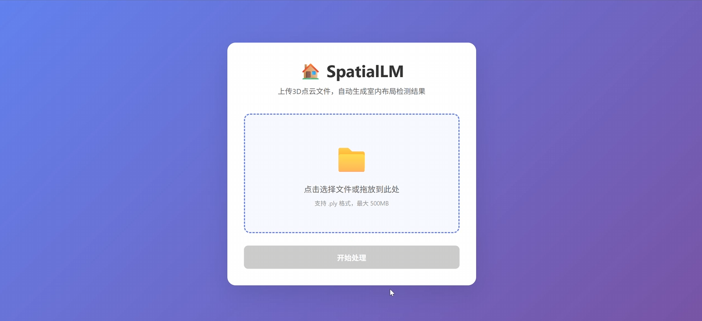
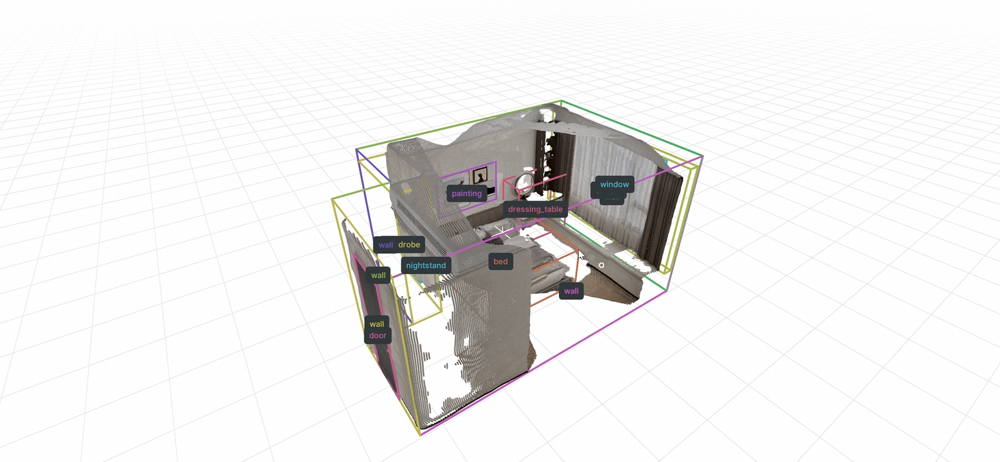

# SpatialLM_on_RDKX5

在 RDK X5 上运行 SpatialLM，使用大模型标注点云数据。本项目实现了 SpatialLM 的 RDK X5的端侧部署。

## 🚀 项目简介

SpatialLM 是一个用于结构化室内建模的大型语言模型，能够从点云数据中提取室内空间的结构化信息和语义标注。本项目针对 RDK X5 平台进行了优化，采用分离部署架构：

```
[PC环境]                    [RDK X5环境]
点云文件 → 点云编码器 → 特征文件 → 传输 → LLM推理 → 可视化
```

## ✨ 主要特性

- 🏠 **室内场景理解**：从点云数据中识别房间布局、家具位置和空间关系
- 🔄 **分离部署架构**：支持 PC 环境编码 + RDK X5 推理的分布式部署
- 🎯 **高精度标注**：基于 SpatialLM 1.1 模型，使用 Qwen-2.5 架构
- 📊 **实时可视化**：支持使用 Rerun 进行 3D 可视化展示
- 🔧 **灵活配置**：支持多种点云编码器和推理后端

## 📋 系统要求

### PC 环境 (点云编码)
- 支持 CUDA 12.4 的 GPU
- Python 3.10-3.12

### RDK X5 环境 (推理和可视化)
- RDK X5 开发板
- 4GB 虚拟内存
- Python 3.10-3.12

## 🛠️ 安装指南

### 客户端 (PC 环境)

```bash
# 创建 conda 环境
conda create -n spatiallm-PC python=3.11
conda activate spatiallm-PC
conda install -y -c nvidia/label/PC-12.4.0 PC-toolkit conda-forge::sparsehash

# 安装依赖
pip install poetry
poetry config virtualenvs.create false --local
poetry install

# 安装点云编码器依赖 (推荐 SpatialLM1.1)
poe install-sonata
```

### 服务端 (RDK X5 环境)

```bash
# 创建 conda 环境
conda create -n spatiallm-cpu python=3.11
conda activate spatiallm-cpu

# 安装依赖
pip install -r requirements_rdkx5.txt
```

## 🚀 快速开始

### 1. 启动 RDK X5 服务端

```bash
./start_rdkx5_server.sh
```

### 2. 启动 PC 客户端

```bash
./start_client.sh
```

### 3. 上传点云并获得结果

启动客户端后，在浏览器中访问 **http://localhost:5000** 进入 SpatialLM Web 界面。

#### 使用步骤：

1. **上传点云文件**：点击"选择文件"按钮，选择 `.ply` 格式的点云文件
2. **开始处理**：点击"开始处理"按钮，系统将自动完成以下流程：
   - 在 PC 端编码点云特征
   - 将编码结果传输到 RDK X5
   - 在 RDK X5 上进行 LLM 推理
   - 生成布局结果和可视化文件
3. **下载结果**：处理完成后可以下载：
   - 3D 可视化文件 (`.rrd`)

| Web 界面上传 | 结果展示 |
|:---:|:---:|
|  |  |


## 📁 项目结构

```
SpatialLM_on_RDKX5/
├── client/                 # PC 环境客户端
│   ├── spatiallm/         # SpatialLM 核心模块
│   ├── encode_pointcloud.py
│   └── DEPLOYMENT_GUIDE.md
├── server/                 # RDK X5 服务端
│   ├── spatiallm/         # SpatialLM 核心模块
│   ├── rdkx5_server.py
│   ├── inference_cpu.py
│   ├── visualize.py
│   └── DEPLOYMENT_GUIDE.md
└── README.md
```

## 📖 使用示例

详细的使用示例请参考：
- [客户端部署指南](client/DEPLOYMENT_GUIDE.md)
- [服务端部署指南](server/DEPLOYMENT_GUIDE.md)

## 🔧 支持的模型

- **SpatialLM-Llama-1B**: 基于 Llama3.2-1B-Instruct
- **SpatialLM-Qwen-0.5B**: 基于 Qwen-2.5 系列 (推荐)

## 🤝 贡献

欢迎提交 Issue 和 Pull Request！

## 📄 License

本项目的许可证信息如下：

### 模型许可证
- **SpatialLM-Llama-1B** 基于 Llama3.2-1B-Instruct，遵循 Llama3.2 许可证
- **SpatialLM-Qwen-0.5B** 基于 Qwen-2.5 系列，遵循 Apache 2.0 许可证

### 组件许可证
- **SpatialLM 1.0** 基于 SceneScript 点云编码器，遵循 CC-BY-NC-4.0 许可证
- **SpatialLM 1.1** 基于 Sonata 点云编码器，模型权重遵循 CC-BY-NC-4.0 许可证，代码基于 Pointcept 遵循 Apache 2.0 许可证
- **TorchSparse** 遵循 MIT 许可证

具体许可证条款请参考各组件的原始许可证文件。

---

**注意**: 本项目使用了 SpatialLM 1.1 版本，基于 Qwen-2.5 架构，在 RDK X5 平台上进行了专门优化。
